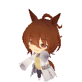
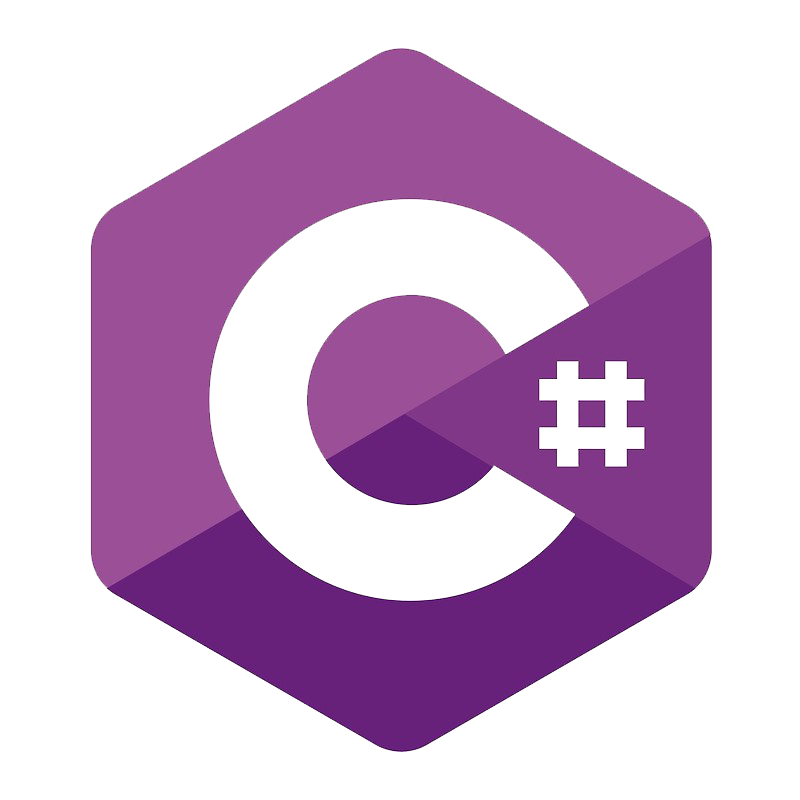
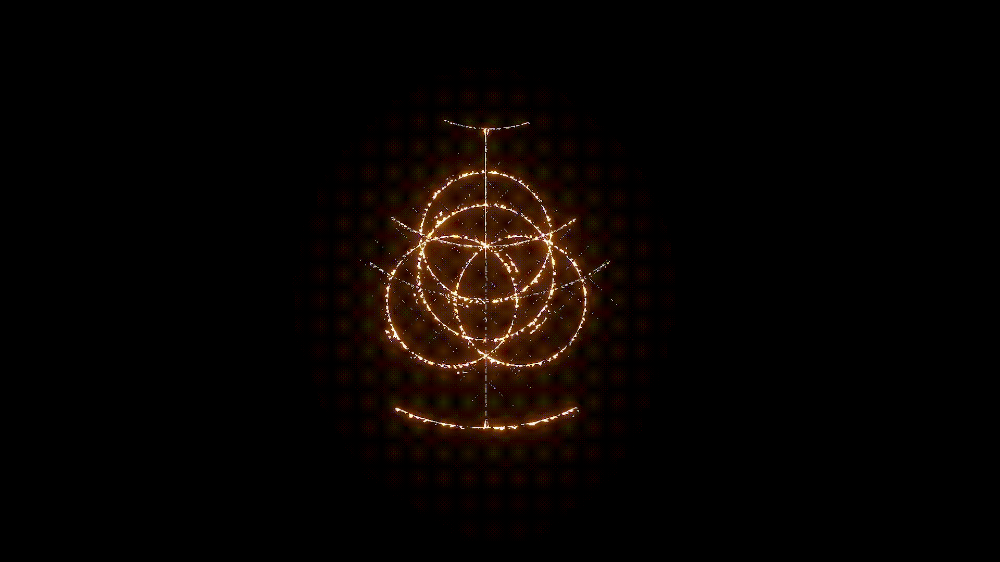

  

  <!-- Your Profile Content on the left side -->
  <b>👋 I'm Ronald!</b> 
  <i>Computer Engineer / 3rd Year Student</i>  
  I am a Computer Engineering student passionate about hardware, programming, and system design.  
  • ✨ <b>Current Rank:</b> 3rd Year Student 
  • 🌱 Willing to Learn new technology everytime 
  • 🚀 Can work under pressure.

<table>
  <tr>
    <td>
      

        <b>📋Personal Profile</b> 
        • <i><b>Fullname: </b>Ronald J. Valera Jr</i> 
        • <i><b>Age: </b> 21</i> 
        • <i><b>Currrent Profession: </b>3rd Year Computer Engineering Student</i>
      

    </td>
    <td>
      

        <b>Programming Languages Learned</b> 
        •  Python 
        •  C++ 
        •  C# 
        •  HTML 
        •  CSS
      

    </td>
  </tr>
</table

  
  
  <b>⚔️Hobbies</b>  
  I do game development in my spare time, working on project that will eventually 
  be deployed in steam within a couple of years. I am also learning to do pixel art for 
  future art projects and to implement it for my game developent project.

